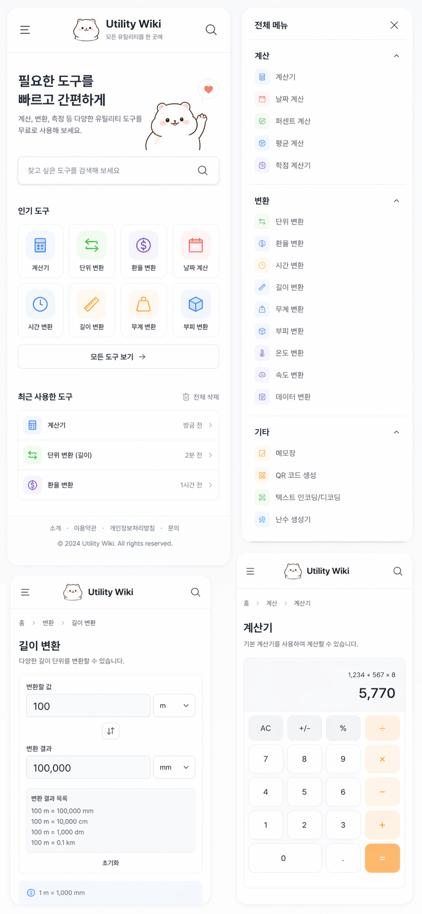
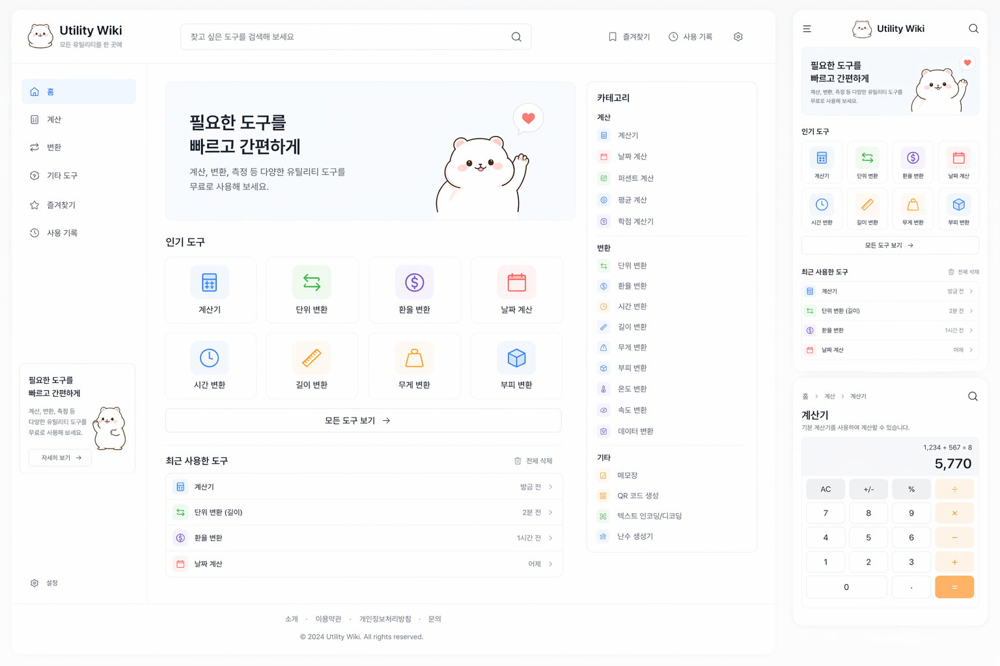

# Utility Wiki 스타일 가이드
_미니멀한 위키 스타일의 모바일/PC 유틸리티 사이트 UI 가이드_

## 1. 프로젝트 개요
Utility Wiki는 **계산기 + 각종 변환기 + 간단한 보조 유틸리티**를 한곳에 모은 서비스예요.  
방향성은 아래 3가지를 핵심으로 잡으면 돼요.

1. **위키처럼 빠르게 찾을 수 있어야 함**
2. **유틸리티 사이트답게 즉시 입력하고 바로 결과가 보여야 함**
3. **너무 딱딱하지 않게 귀엽고 친근한 브랜드 무드가 있어야 함**

---

## 2. 핵심 키워드
- 미니멀
- 위키형 탐색
- 빠른 접근
- 작은 카드 중심
- 라운드 UI
- 연한 파스텔 포인트
- 귀여운 마스코트/로고
- 모바일 우선
- 가독성 높은 정보 밀도

---

## 3. 참고 이미지
### 모바일 시안


### PC 시안


---

## 4. 브랜드 방향
### 서비스명
**Utility Wiki**

### 브랜드 톤
- 친절함
- 단정함
- 부담 없는 귀여움
- 도구 중심의 실용성
- 위키/디렉토리 같은 정리감

### 마스코트/로고 방향
- 햄스터/곰돌이 느낌의 둥근 흰색 캐릭터
- 얼굴은 단순한 점 눈 + 작은 입
- 외곽선은 진하지 않은 부드러운 브라운/그레이
- 크기는 작게, 과하게 튀지 않게 사용
- 로고는 “캐릭터 + Utility Wiki 워드마크” 조합

---

## 5. 정보 구조(IA)
### 1차 메뉴
- 홈
- 계산
- 변환
- 기타 도구
- 즐겨찾기
- 사용 기록
- 설정

### 계산 카테고리 예시
- 기본 계산기
- 날짜 계산
- 퍼센트 계산
- 평균 계산
- 학점 계산
- 대출 계산
- 부가세 계산
- 복리 계산

### 변환 카테고리 예시
- 단위 변환
- 환율 변환
- 시간 변환
- 길이 변환
- 무게 변환
- 부피 변환
- 온도 변환
- 속도 변환
- 데이터 변환

### 기타 도구 예시
- 메모장
- QR 코드 생성기
- 텍스트 인코딩/디코딩
- 난수 생성기
- 비밀번호 생성기
- JSON 포매터
- Base64 인코더/디코더

---

## 6. 레이아웃 원칙
## 모바일
구조는 아래 순서를 추천해요.

1. 상단 앱바
2. 히어로 영역
3. 검색창
4. 인기 도구 그리드
5. 최근 사용 도구
6. 전체 메뉴/카테고리 진입
7. 하단 푸터

### 모바일 특징
- 한 손 사용 기준
- 주요 도구는 2열 또는 4열 아이콘 카드
- 자주 쓰는 기능을 첫 화면에서 바로 노출
- 상세 페이지는 입력 폼 + 결과 영역 + 예시/팁 구조

## PC
구조는 **좌측 사이드바 + 중앙 메인 + 우측 카테고리/보조영역** 3단 구성이 좋아요.

### PC 레이아웃 추천
- 좌측: 내비게이션
- 중앙: 메인 콘텐츠
- 우측: 카테고리, 빠른 링크, 추천 도구
- 상단: 글로벌 검색 + 즐겨찾기/기록/설정
- 메인: 히어로 > 인기 도구 > 최근 사용 도구
- 하단: 푸터

---

## 7. 디자인 토큰
아래 값은 바로 코드에 옮기기 쉬운 기준값이에요.

```css
:root {
  --bg: #f6f7f9;
  --surface: #ffffff;
  --surface-muted: #f9fafb;
  --border: #e7eaf0;
  --border-strong: #d9dee8;
  --text-primary: #1f2937;
  --text-secondary: #6b7280;
  --text-tertiary: #9aa3af;

  --accent-blue: #5b8def;
  --accent-green: #63c174;
  --accent-purple: #8b6fe8;
  --accent-red: #f27f7f;
  --accent-orange: #f5b25c;
  --accent-yellow: #f3c96b;

  --icon-blue-bg: #eef4ff;
  --icon-green-bg: #eefaf0;
  --icon-purple-bg: #f4efff;
  --icon-red-bg: #fff0f0;
  --icon-orange-bg: #fff5e9;
  --icon-yellow-bg: #fff8e8;

  --shadow-sm: 0 2px 8px rgba(31, 41, 55, 0.04);
  --shadow-md: 0 8px 24px rgba(31, 41, 55, 0.06);

  --radius-sm: 12px;
  --radius-md: 16px;
  --radius-lg: 20px;
  --radius-xl: 24px;

  --container-desktop: 1440px;
  --container-content: 1200px;
}
```

---

## 8. 타이포그래피
추천 폰트:
- Pretendard
- Inter
- Noto Sans KR

### 텍스트 스케일
- Display: 40 / 700
- H1: 32 / 700
- H2: 24 / 700
- H3: 20 / 700
- Title: 18 / 600
- Body: 15~16 / 400~500
- Caption: 12~13 / 400

### 사용 원칙
- 숫자는 계산기/결과 영역에서 더 크게
- 본문은 15~16px 유지
- 설명문은 연한 회색
- 페이지 제목은 무조건 명확하게 크게

---

## 9. 컴포넌트 가이드
## 9-1. 상단 헤더
구성:
- 햄버거 또는 로고
- 브랜드 로고
- 검색
- 즐겨찾기 / 사용 기록 / 설정

스타일:
- 높이 64~72px
- 하얀 배경
- 아래쪽 1px 보더
- 검색창은 길고 둥근 모양

## 9-2. 히어로 카드
역할:
- 사이트 설명
- 대표 캐릭터 노출
- 바로 검색 유도

스타일:
- 큰 라운드 카드
- 좌측 카피, 우측 캐릭터
- 아주 연한 회색 배경
- CTA는 없어도 되고, 검색창과 연결되면 좋음

## 9-3. 아이콘 도구 카드
구성:
- 파스텔 원/사각 배경 아이콘
- 도구명
- 선택 시 hover/pressed 상태

스타일:
- 정사각형 또는 세로형 카드
- 카드 패딩 16~20px
- 보더 1px
- hover 시 약한 shadow + border 강조

## 9-4. 최근 사용 리스트
구성:
- 아이콘
- 도구명
- 보조 텍스트(예: 길이 변환)
- 시간(방금 전, 1시간 전)
- 우측 화살표

## 9-5. 카테고리 패널
역할:
- 계산 / 변환 / 기타 도구 빠른 이동
- 위키처럼 탐색하는 느낌 강화

## 9-6. 입력 폼
스타일:
- input 높이 48~56px
- select 같은 높이 통일
- 내부 여백 넉넉하게
- 포커스 시 파란 테두리 + 아주 약한 글로우

## 9-7. 결과 패널
구성:
- 큰 결과값
- 단위 변경
- 추가 변환 결과 목록
- 참고 팁 또는 공식 설명

스타일:
- 입력창보다 한 단계 더 강조
- 숫자는 굵고 크게
- 결과는 복사 가능하게 하면 좋음

## 9-8. 계산기 키패드
스타일:
- 버튼 간격 일정
- 숫자키는 흰색/연회색
- 연산 키는 옅은 오렌지 배경
- = 버튼만 가장 강조

---

## 10. 페이지별 구조
## 홈
- 헤더
- 히어로
- 검색창
- 인기 도구
- 전체 카테고리
- 최근 사용 도구
- 푸터

## 전체 메뉴/디렉토리
- 카테고리별 아코디언
- 검색 결과
- 인기/추천/최신 정렬

## 도구 상세 페이지
예: 길이 변환 / 계산기 / 환율 변환

구성:
- 브레드크럼
- 페이지 제목
- 간단 설명
- 입력 영역
- 결과 영역
- 추가 결과 목록
- 하단 팁/공식/관련 도구

---

## 11. 인터랙션 가이드
- Hover: 배경 약간 진해짐
- Focus: 2px accent outline
- Active: scale 0.98 정도
- Card hover: border 강조 + shadow-sm
- Search input focus: 검색이 메인 기능이라 상태가 분명해야 함
- Accordion: 부드러운 160~220ms 전환
- Calculator 버튼: 눌림 상태 확실히 표현

### 모션 기준
- transition: 160ms ~ 220ms ease
- 너무 화려한 애니메이션은 금지
- 마스코트는 살짝만 등장시키고 움직임은 최소화

---

## 12. 반응형 기준
```txt
Mobile: 360 ~ 767
Tablet: 768 ~ 1199
Desktop: 1200+
Wide: 1440+
```

### 반응형 규칙
- 모바일: 1열 중심, 카드 2~4열 혼합
- 태블릿: 2단 구성 가능
- 데스크탑: 3단 레이아웃
- 작은 화면에서는 우측 패널을 접고 상단/하단으로 이동

---

## 13. 접근성 가이드
- 본문 대비 4.5:1 이상
- 클릭 영역 최소 44px
- 키보드 포커스 이동 가능
- 결과값은 스크린리더에서 읽기 쉽게 aria-live 고려
- 색만으로 상태를 구분하지 말 것
- 아이콘에는 라벨 또는 sr-only 텍스트 제공

---

## 14. 구현 우선순위
코덱스에서 먼저 만들면 좋은 순서예요.

1. 레이아웃 프레임
2. 디자인 토큰
3. 공통 헤더/사이드바
4. 도구 카드 컴포넌트
5. 홈 화면
6. 계산기 상세 페이지
7. 길이/단위 변환 상세 페이지
8. 전체 메뉴 페이지
9. 즐겨찾기/최근 사용 로직
10. 검색

---

## 15. 코덱스용 구현 지침
### 추천 스택
- Next.js
- React
- TypeScript
- Tailwind CSS 또는 CSS Modules
- Lucide Icons

### 컴포넌트 구조 예시
```txt
app/
  page.tsx
  calculator/page.tsx
  convert/length/page.tsx
  menu/page.tsx

components/
  layout/
    Header.tsx
    Sidebar.tsx
    RightPanel.tsx
    Footer.tsx
  common/
    SearchBar.tsx
    SectionTitle.tsx
    Breadcrumb.tsx
  cards/
    ToolCard.tsx
    RecentToolItem.tsx
    CategoryList.tsx
  tools/
    CalculatorPad.tsx
    ConvertForm.tsx
    ResultPanel.tsx
  brand/
    Logo.tsx
    Mascot.tsx
```

### 데이터 모델 예시
```ts
type ToolCategory = "계산" | "변환" | "기타";

interface ToolItem {
  id: string;
  name: string;
  slug: string;
  description: string;
  category: ToolCategory;
  icon: string;
  accent: "blue" | "green" | "purple" | "red" | "orange" | "yellow";
  isPopular?: boolean;
}
```

---

## 16. 홈 화면 샘플 섹션 카피
### 히어로 타이틀
필요한 도구를  
빠르고 간편하게

### 히어로 설명
계산, 변환, 측정 등 다양한 유틸리티 도구를  
무료로 사용해 보세요.

### 검색 플레이스홀더
찾고 싶은 도구를 검색해 보세요

### 섹션 타이틀
- 인기 도구
- 최근 사용한 도구
- 전체 메뉴
- 추천 도구

---

## 17. 상세 페이지 예시 규칙
### 계산기
- 상단 식 표시
- 큰 결과 숫자
- 4열 키패드
- 연산자 버튼 컬러 구분

### 길이 변환
- 입력 값
- 입력 단위
- 스왑 버튼
- 결과 값
- 결과 단위
- 하단에 추가 환산 리스트
- 최하단에 짧은 팁 박스

### 환율 변환
- 금액
- 기준 통화 / 대상 통화
- 최근 환율 시점
- 결과값
- 자주 쓰는 통화 즐겨찾기

---

## 18. 피해야 할 것
- 너무 진한 색
- 과한 입체감/글래스모피즘
- 복잡한 배너 광고 스타일
- 두꺼운 보더 남발
- 정보보다 캐릭터가 더 튀는 구성
- 너무 많은 CTA 버튼
- 복잡한 그래프 남용

---

## 19. 한 줄 디자인 정의
> “위키처럼 정돈되어 있고, 계산기 앱처럼 빠르며, 귀여운 캐릭터가 살짝 온기를 더하는 유틸리티 UI”

---

## 20. 코덱스 프롬프트용 요약
아래 문장을 코덱스에 바로 넣어서 초기 구현을 시킬 수 있어요.

```txt
Create a responsive Utility Wiki website UI in Next.js + TypeScript.
Style it as a minimalist wiki-inspired utility service with soft pastel accents, rounded cards, subtle borders, and a cute mascot logo.
Build desktop and mobile-friendly layouts.

Pages:
- Home
- Calculator detail page
- Length converter detail page
- Full menu/category page

Include:
- left sidebar on desktop
- top search bar
- hero section with mascot
- popular tools card grid
- recent tools list
- right category panel on desktop
- simple footer
- clean, light gray background
- white cards with soft borders
- Korean UI labels

The UI should feel organized, friendly, and practical rather than flashy.
```